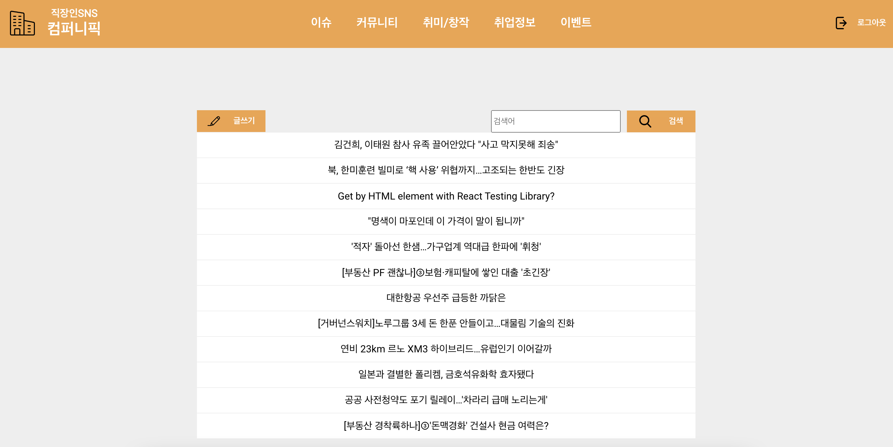

# bulletin-board-front project



## Project Description
학부 3학년 과정 중 2명의 동료와 함께 수행한 게시판 웹 개발 프로젝트입니다. database (DB), back-end (BE), front-end (FE) 기술 스택을 단기간에 습득해야 했습니다. 당시에 촉박한 일정 때문에 밤늦게까지 DB 이론과 기술 스택을 공부하며 ER diagram의 사상, postgreSQL 통한 정규화 된 릴레이션 생성, query, trigger, transaction를 구현하기 위해 노력했습니다. 프로젝트를 통해 신속한 구현을 위해서는 풍부한 이론적 지식과 기술 스택 사용 경험이 중요하다는 것을 느꼈습니다. 개인적으로 프로젝트를 복기하면서 제가 담당한 역할에서 그치지 않고 node.js, express, MVC 패턴 등 BE 기술 스택과 javascript, react 등 FE 기술 스택을 구현 하면서 다양한 경험을 쌓았습니다.

- Back-End repository
    - https://github.com/cjlee9393/bulletin-board-api

- Database repository
    - https://chivalrous-newsprint-a46.notion.site/DB-1fe1022150b14c1f858b22cfd01455d4

## Usage
- Web app
    ```bash
    # install dependencies
    npm i

    # run the app on port 8080
    npm run start
    ```

## Dependencies
| Type | Description |
| ----------- | ----------- |
| Software | The project is tested on Google Chrome 100.0.4896.75(official build) (arm64) with javascript version 1.7 |
| Firmware | No known dependency |
| Hardware | the project is tested on MacBook Air (M1, 2020) |

```javascript
"dependencies": {
    "@testing-library/jest-dom": "^5.16.5",
    "@testing-library/react": "^13.4.0",
    "@testing-library/user-event": "^13.5.0",
    "react": "^18.2.0",
    "react-dom": "^18.2.0",
    "react-router-dom": "^6.4.3",
    "react-scripts": "5.0.1",
    "styled-components": "^5.3.6",
    "uuid": "^9.0.0",
    "web-vitals": "^2.1.4"
},
"devDependencies": {
    "@storybook/addon-actions": "^6.5.13",
    "@storybook/addon-essentials": "^6.5.13",
    "@storybook/addon-interactions": "^6.5.13",
    "@storybook/addon-links": "^6.5.13",
    "@storybook/builder-webpack5": "^6.5.13",
    "@storybook/manager-webpack5": "^6.5.13",
    "@storybook/node-logger": "^6.5.13",
    "@storybook/preset-create-react-app": "^4.1.2",
    "@storybook/react": "^6.5.13",
    "@storybook/testing-library": "^0.0.13",
    "babel-plugin-named-exports-order": "^0.0.2",
    "history": "^5.3.0",
    "prop-types": "^15.8.1",
    "webpack": "^5.74.0"
  }
```


### References
- design
    - <a href="https://www.campuspick.com/" title="캠퍼스픽">Website design reference</a>

- icons
    - <a href="https://www.flaticon.com/free-icons/search" title="search icons">Search icons created by Smashicons - Flaticon</a>
    - <a href="https://www.flaticon.com/free-icons/company" title="company icons">Company icons created by Pixel perfect - Flaticon</a>
    - <a href="https://www.flaticon.com/free-icons/edit" title="edit icons">Edit icons created by Kiranshastry - Flaticon</a>
    - <a href="https://www.flaticon.com/free-icons/write" title="write icons">Write icons created by Freepik - Flaticon</a>
    - <a href="https://www.flaticon.com/free-icons/delete" title="delete icons">Delete icons created by Ilham Fitrotul Hayat - Flaticon</a>
    - <a href="https://www.flaticon.com/free-icons/logout" title="logout icons">Logout icons created by Afian Rochmah Afif - Flaticon</a>